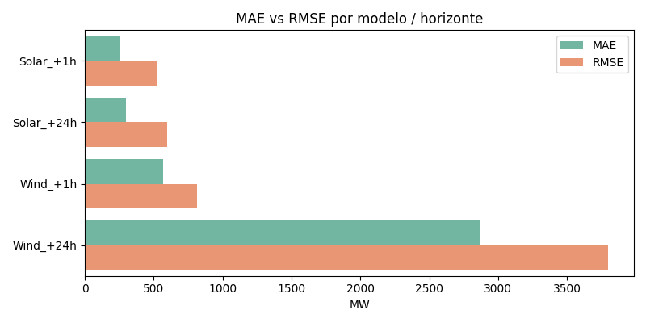
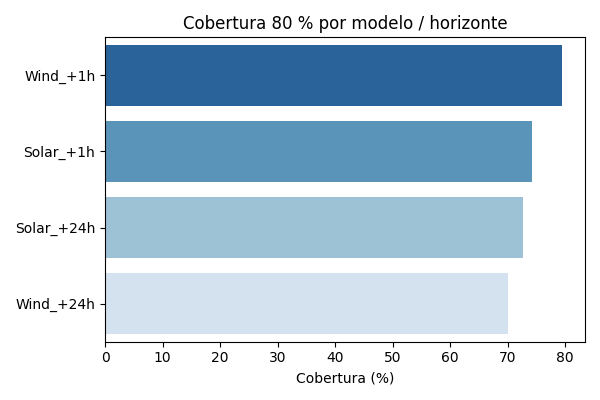
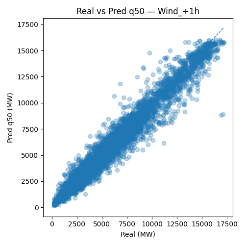

# ☀️💨 Solar–Wind Short-Term Forecast (French Grid)
**Probabilistic +1 h / +24 h renewable-power prediction**

[](https://youtu.be/07ljskwOW_8)
[](https://public.tableau.com/app/profile/juan.carlos.aguirre1722/viz/Dashboard_project_AI/MtricaseImportancia)
[](https://public.tableau.com/app/profile/juan.carlos.aguirre1722/viz/Dashboard_project_AI/MtricaseImportancia)

---

## 📘 Overview
This project builds *hour-ahead* and *day-ahead* forecasts of solar and wind generation for mainland France.  
A **Quantile Gradient-Boosting Regressor (QGBR)** produces probabilistic predictions (q10–q90) instead of single-point values, giving both accuracy and uncertainty estimation.  
All outputs are visualized in Tableau for interactive exploration.

---

## 📁 Repository contents

| Path | Description |
|------|--------------|
| `project_v5.py` | End-to-end Python pipeline – data ingest, feature engineering, model training, back-testing, SHAP explainability. |
| `database_power_production.csv` | Input dataset (downloaded from Kaggle, see below). |
| `outputs/` | Folder containing all figures and plots generated by the script. |
| `Dashboard_project_AI.twbx` | Tableau workbook file (local version of the dashboard). |
| *(Tableau Public link below)* | Online interactive version for quick view. |

---

## 🧠 1. Background

**Dataset:** Hourly solar and wind production (MW) for mainland France (2020 → present) —  
published by the *Commission de Régulation de l’Énergie (CRE)* to compute reference prices for variable premiums.  
Source: [Kaggle – Wind & Solar Electricity Production](https://www.kaggle.com/datasets/henriupton/wind-solar-electricity-production)

**Goal:** Provide probabilistic (+1 h and +24 h) forecasts to anticipate revenue gaps covered by the CRE premium mechanism.  
**Why QGBR?** Ensemble trees capture non-linear weather patterns and, with quantile loss, produce prediction intervals rather than single outputs.

---

## ⚙️ 2. Pipeline summary

| Phase | Description |
|-------|--------------|
| 1 | Load and clean the CRE dataset. |
| 2 | Quick EDA and seasonal plots. |
| 3 | Feature engineering: calendar cycles, lags, rolling means, holidays, daylight flag. |
| 4 | Baselines: Persistence (+1 h) and Seasonal-Naïve (+24 h). |
| 5 | Train/test split (80 / 20 %) per resource and horizon. |
| 6 | Quantile Gradient-Boosting models (q10 / q50 / q90). |
| 7 | Evaluation with MAE, RMSE, and Coverage 80 %. |
| 8 | SHAP explainability (top-12 features). |
| 9 | Export CSVs and figures for Tableau. |
| 10 | Light back-testing on four rolling cut-offs. |

---

## 📊 3. Key results

### 🔹 MAE vs RMSE per model / horizon


Short-term (+1 h) models clearly outperform day-ahead (+24 h) ones,  
and solar forecasts are more accurate than wind due to stronger daily seasonality.

---

### 🔹 80 % coverage per model


The coverage metric measures how many real values fall inside the [q10, q90] interval.  
Most models achieve coverage close to 80 %, meaning the uncertainty bands are well calibrated.

---

### 🔹 Diagnostic scatter – Wind +1 h


Scatter plot of real vs predicted power (q50).  
Points around the diagonal indicate accurate predictions; dispersion shows variability of wind generation.

---

## 📊 4. Interactive dashboards

[](https://public.tableau.com/app/profile/juan.carlos.aguirre1722/viz/Dashboard_project_AI/Pronsticoprobabilsticodeproduccinsolaryelica1hy24henFrancia)
[](https://public.tableau.com/app/profile/juan.carlos.aguirre1722/viz/Dashboard_project_AI/MtricaseImportancia)

> Packaged Tableau file `Dashboard_project_AI.twbx` is also provided in this repository for offline viewing.

---

## 🔬 5. Tech stack

- **Language:** Python 3.10  
- **Libraries:** Pandas · NumPy · Scikit-Learn · Matplotlib · Seaborn · Statsmodels · Holidays · SHAP  
- **Visualization:** Tableau Desktop / Tableau Public  
- **Environment:** Tested on 16 GB RAM machine (Windows 10)

---

## 🚀 6. Reproducibility

```bash
# Clone the repository
git clone https://github.com/yourusername/solar-wind-forecast.git
cd solar-wind-forecast

# Place the Kaggle dataset in the same folder
# Run the script
python project_v5.py
